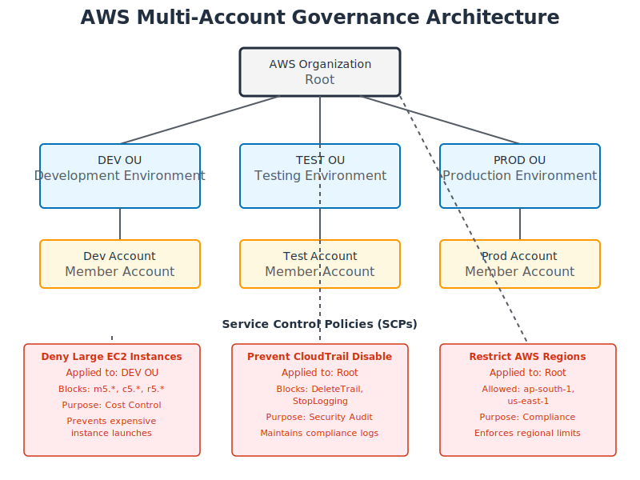
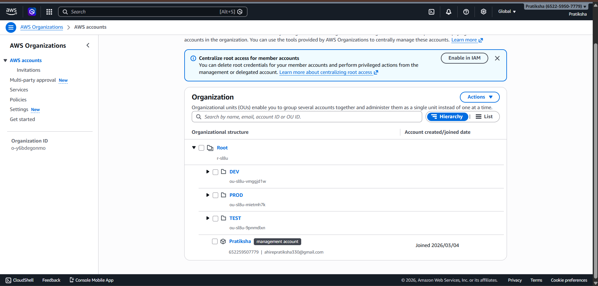
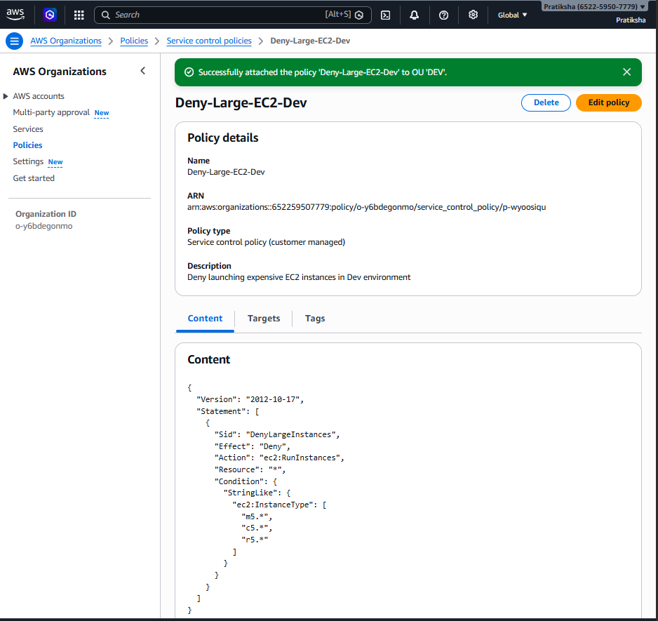
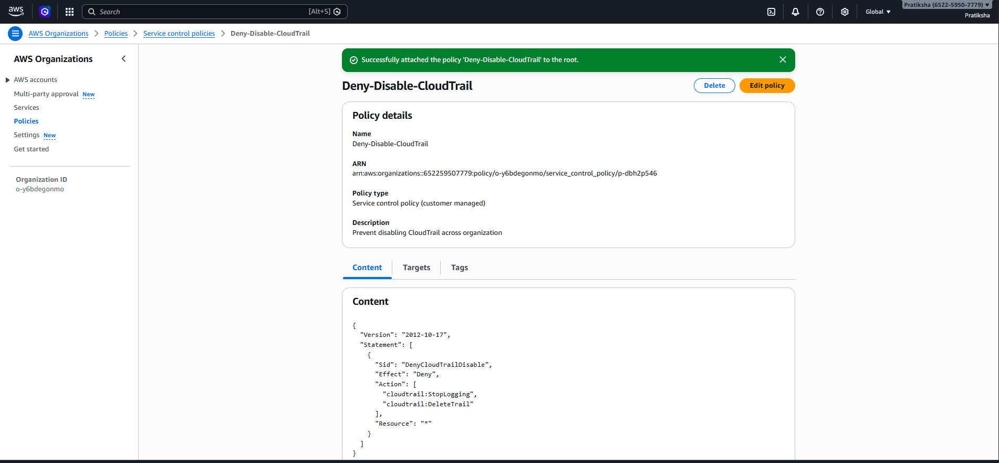
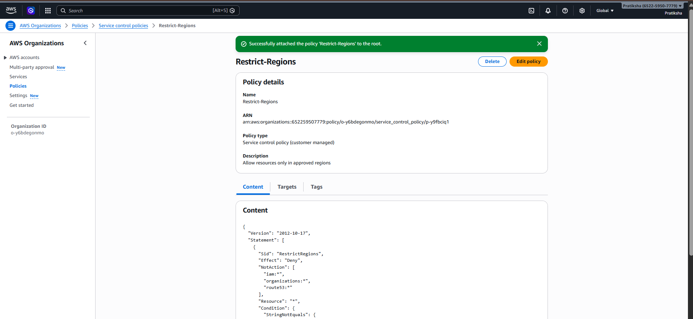
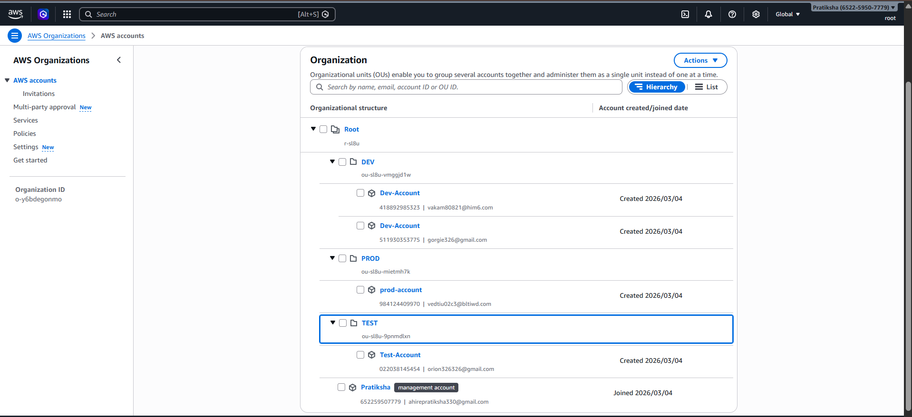
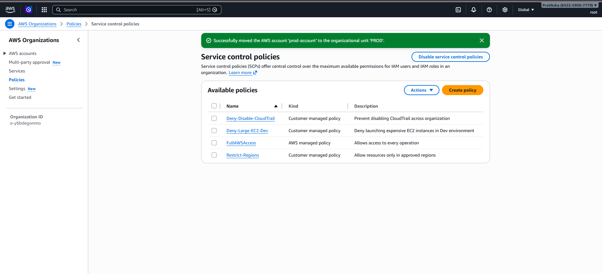

# Multi-Account AWS Governance using AWS Organizations & Service Control Policies

## Project Overview

This project demonstrates how to implement centralized governance across multiple AWS accounts using **AWS Organizations**, **Organizational Units (OUs)**, and **Service Control Policies (SCPs)**.

In large enterprises, multiple teams use separate AWS accounts for development, testing, and production environments. Without governance controls, developers may create expensive resources or disable critical security services.

This project implements policies to enforce **security, cost control, and compliance** across all AWS accounts.

---

# Architecture



```
AWS Organization
        │
       Root
        │
 ┌──────┼────────┐
 DEV    TEST     PROD
  │       │        │
Dev     Test      Prod
Account Account   Account
```

### Governance Policies

| OU / Level | Policy Applied          | Purpose                                   |
| ---------- | ----------------------- | ----------------------------------------- |
| DEV OU     | Deny-Large-EC2-Dev      | Prevent launching expensive EC2 instances |
| Root       | Deny-Disable-CloudTrail | Prevent disabling security logging        |
| Root       | Restrict-Regions        | Allow resources only in approved regions  |

---

# Technologies Used

* AWS Organizations
* Organizational Units (OUs)
* Service Control Policies (SCP)
* AWS IAM
* AWS CloudTrail

---

# Organizational Structure

```
Root
 ├── DEV
 │     └── Dev-Account
 ├── TEST
 │     └── Test-Account
 └── PROD
       └── Prod-Account
```

Each environment is isolated using separate AWS accounts.

### AWS Organization Structure



### Organizational Units (OUs)



---

# Implemented Service Control Policies



### Policy Attachments



## 1. Deny Large EC2 Instances (Cost Control)

This policy prevents developers from launching expensive EC2 instance types in the **Dev environment**.

Restricted instance types include:

* m5.*
* c5.*
* r5.*

Purpose:

* Prevent accidental high-cost infrastructure creation.

**Policy JSON:** [deny-large-ec2-dev.json](policies/deny-large-ec2-dev.json)

```json
{
  "Version": "2012-10-17",
  "Statement": [
    {
      "Sid": "DenyLargeEC2InstancesInDev",
      "Effect": "Deny",
      "Action": "ec2:RunInstances",
      "Resource": "arn:aws:ec2:*:*:instance/*",
      "Condition": {
        "StringLike": {
          "ec2:InstanceType": [
            "m5.*",
            "c5.*",
            "r5.*"
          ]
        }
      }
    }
  ]
}
```

---

## 2. Prevent Disabling CloudTrail (Security Governance)

CloudTrail records all AWS API activities.

This policy prevents:

* Deleting CloudTrail
* Stopping CloudTrail logging

Purpose:

* Maintain security audit logs across all accounts.

**Policy JSON:** [prevent-cloudtrail-disable.json](policies/prevent-cloudtrail-disable.json)

```json
{
  "Version": "2012-10-17",
  "Statement": [
    {
      "Sid": "PreventCloudTrailDisable",
      "Effect": "Deny",
      "Action": [
        "cloudtrail:DeleteTrail",
        "cloudtrail:StopLogging",
        "cloudtrail:UpdateTrail"
      ],
      "Resource": "*"
    }
  ]
}
```

---

## 3. Restrict AWS Regions (Compliance)

This policy allows resource creation only in approved regions.

Allowed regions:

* ap-south-1
* us-east-1

Purpose:

* Enforce compliance and reduce operational complexity.

**Policy JSON:** [restrict-regions.json](policies/restrict-regions.json)

```json
{
  "Version": "2012-10-17",
  "Statement": [
    {
      "Sid": "RestrictRegions",
      "Effect": "Deny",
      "NotAction": [
        "iam:*",
        "organizations:*",
        "route53:*",
        "budgets:*",
        "waf:*",
        "cloudfront:*",
        "support:*",
        "sts:*"
      ],
      "Resource": "*",
      "Condition": {
        "StringNotEquals": {
          "aws:RequestedRegion": [
            "ap-south-1",
            "us-east-1"
          ]
        }
      }
    }
  ]
}
```

---

# Validation Process

To validate governance policies:

1. Switch to a member account (Dev account).
2. Attempt to launch a restricted EC2 instance (example: m5.large).
3. Attempt to disable CloudTrail logging.
4. Attempt to deploy resources in a restricted region.

Expected Result:

```
AccessDenied
```

This confirms that Service Control Policies are successfully enforced.

## Validation Screenshots

### 1. EC2 Instance Launch Denied



Attempting to launch a restricted EC2 instance type (m5.large) in the Dev account results in an **AccessDenied** error, confirming the SCP is working.

### 2. CloudTrail Protection Enforced



Attempting to disable or delete CloudTrail is blocked by the SCP, ensuring audit logs remain intact across all accounts.

---

# Governance Benefits

* Centralized control of AWS accounts
* Prevents misuse of cloud resources
* Improves security monitoring
* Ensures compliance with organizational policies
* Reduces risk of misconfiguration

---

# Key Learning Outcomes

* Implement AWS multi-account architecture
* Use Organizational Units for environment separation
* Apply Service Control Policies for governance
* Enforce security and cost management controls
* Understand enterprise cloud governance models

---

# Possible Interview Questions

### What is AWS Organizations?

AWS Organizations allows centralized management and governance of multiple AWS accounts.

### What are Organizational Units (OUs)?

OUs are logical containers used to group AWS accounts and apply policies collectively.

### What is a Service Control Policy (SCP)?

SCPs define the maximum permissions available for AWS accounts in an organization.

### Do SCPs apply to the management account?

No. SCPs only apply to member accounts within the organization.

### What is the difference between IAM policy and SCP?

| IAM Policy             | SCP                        |
| ---------------------- | -------------------------- |
| Grants permissions     | Limits maximum permissions |
| Applied to users/roles | Applied to AWS accounts    |

---

# Conclusion

This project demonstrates how enterprises implement centralized governance using AWS Organizations and Service Control Policies. The solution ensures cost control, security compliance, and operational consistency across multiple AWS environments.

---

# Project Structure

```
Multi-Account-AWS-Governance/
├── README.md                              # Complete project documentation
├── architecture-diagram.svg               # Visual architecture diagram
├── policies/                              # SCP JSON policies
│   ├── deny-large-ec2-dev.json           # Cost control policy for Dev
│   ├── prevent-cloudtrail-disable.json   # Security audit policy
│   └── restrict-regions.json             # Regional compliance policy
├── 01-organization-structure.png         # AWS Organization setup
├── 02-organizational-units.png           # OU hierarchy
├── 03-scp-policies.png                   # Created SCPs
├── 04-policy-attachment.png              # Policy attachments to OUs
├── 05-access-denied-ec2.png              # Validation: EC2 denied
└── 06-cloudtrail-protection.png          # Validation: CloudTrail protected
```

---

# Deliverables

✅ **SCP JSON Policies** - All three policies documented in `/policies` folder  
✅ **Architecture Diagram** - Visual representation of multi-account structure  
✅ **OU Structure Screenshots** - Complete organizational hierarchy  
✅ **Policy Enforcement Proof** - Access denied validations captured  
✅ **Governance Documentation** - Comprehensive README with implementation details

---
